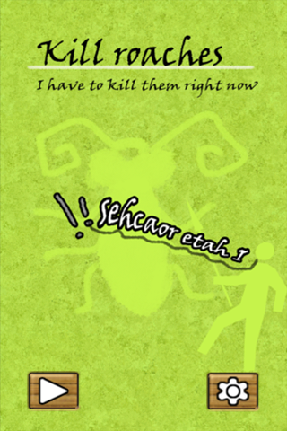
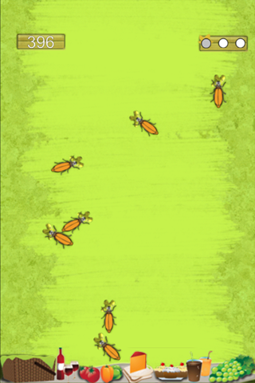
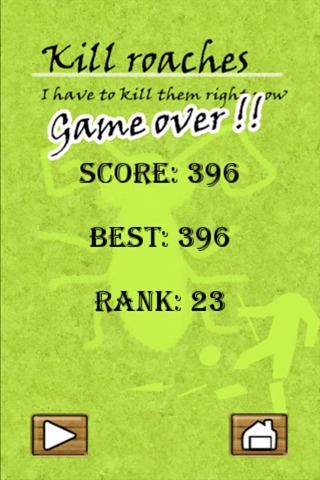



##产品名称
*[躲开方块](http://android.myapp.com/myapp/detail.htm?apkName=cn.lazysprite.blocks)*  

##搜索关键词
**kill Roaches,tap,Crazy screen ，The fierce game **
##图片简介

##已发布平台

*[腾讯应用 pc](http://android.myapp.com/myapp/detail.htm?apkName=cn.lazysprite.blocks)*  
*[腾讯应用 移动](http://app.qq.com/#id=detail&appid=1101722190)*  
*[360应用市场](http://zhushou.360.cn/detail/index/soft_id/1821207?recrefer=SE_D_%E8%BA%B2%E5%BC%80%E6%96%B9%E5%9D%97)*  

##相关简介
*    
小球的魔力相互吸引，方块的不规则运动，躲开方块2不一样的体验。和经典模式相比，挑战模式的难度大大增加，如果你是一个喜欢刺激的玩家，快来试试吧！！！

##
-[躲开方块](http://android.myapp.com/myapp/detail.htm?apkName=cn.lazysprite.blocks)  

Please take a look at [{{ site.categories.api.first.title }}]({{ BASE_PATH }}{{ site.categories.api.first.url }})
or jump right into [Usage]({{ BASE_PATH }}{{ site.categories.usage.first.url }}) if you'd like.
